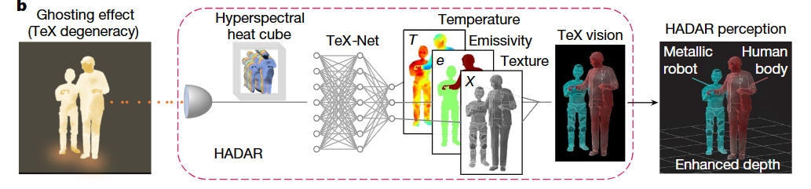
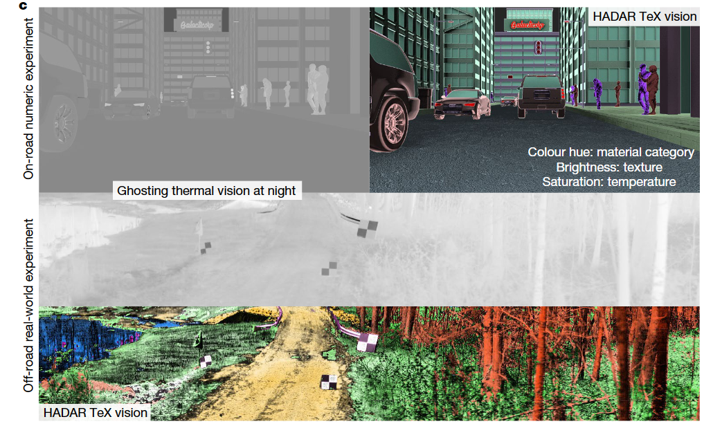
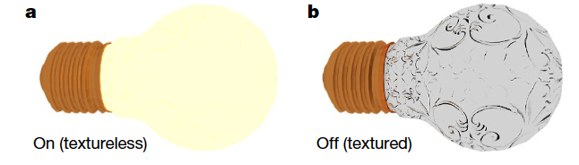
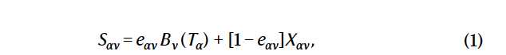
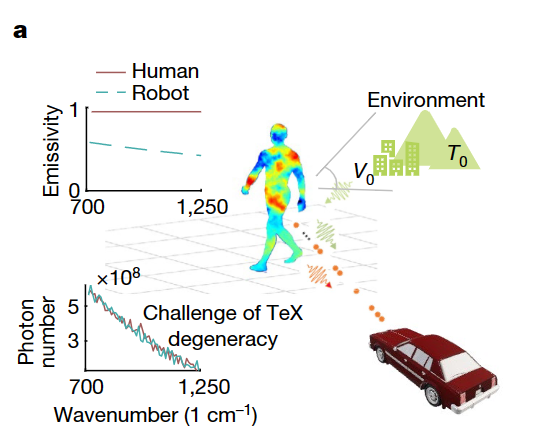
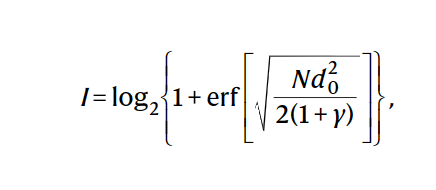
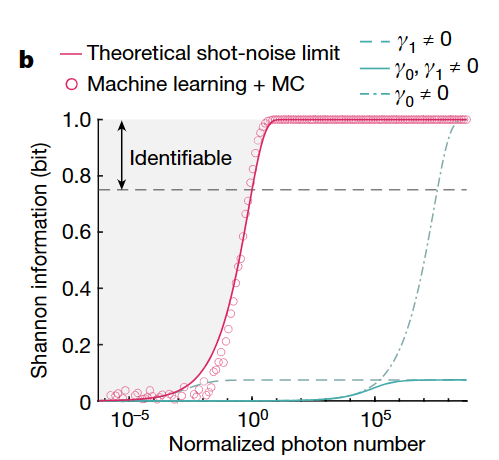
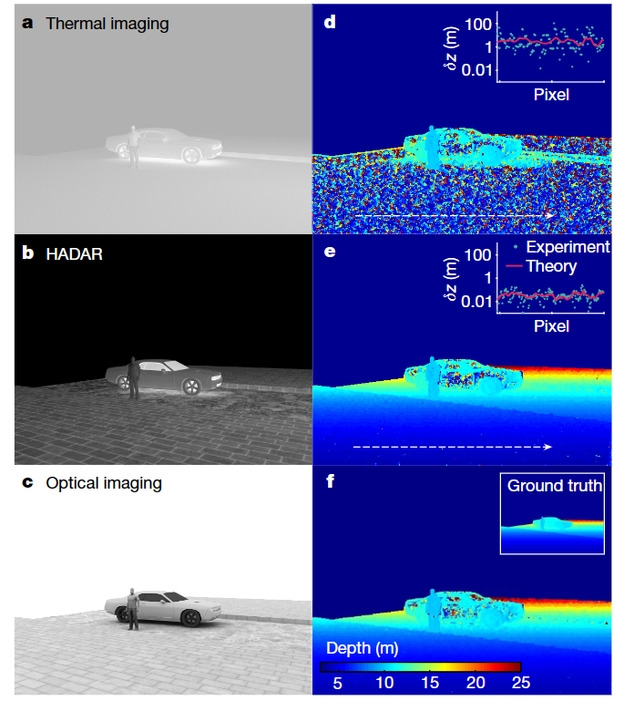

# Heat-assisted detection and ranging

## 摘要

**机器感知**使用先进的传感器来收集周围环境的信息，以实现对于周围状况的感知。最新的机器感知方法使用主动声呐、雷达、激光雷达等方法来增强视觉显示时遇到了智能代理规模增长过快的问题。

> 智能代理：指一个可以观察周遭环境并作出行动以达致目标的自主实体，比如说具有探知周围环境功能的汽车、无人机等。当智能代理规模增大时产生的信息会彼此干扰（比如说各种设备的雷达波会彼此干扰)。

因此，利用无处不在的热信号来辅助成像成为了研究前沿，因为它是scalable的（不会由于智能代理数量太多而失效）。

热成像有很多问题，首先是各种物体及周边的环境都会发射和漫反射各种热辐射，这就导致热成像会有“鬼影”，这种信息丢失并没有什么特异性，会导致热测距（对于自动驾驶至关重要的技术）非常困难。即使使用AI辅助也非常的困难。

在本文中，我们提出并实验性地证明了一种新方法：热辅助的成像和测距技术(HADAR)。它克服了由鬼影导致的开放性问题，并且我们将该方法与AI增强的热感知技术对比。HADAR不仅能像白天一样看到物体的材质、深度，也能获得一些在RGB以及热感应之外的简单属性。为完全被动和物理感知的机器感知铺平了道路。

> 被动感知：与主动感知相对，比如主动雷达就是主动感知，主动感知会影响到周边环境。而被动感知可以对环境不产生干扰。

我们的HADAR在夜间打败了热测距、并且可以与白天的RGB图像准确度相当。

# 正文

工业4.0预示着大量的人机交互场景，然而很多场景不允许使用主动感知，而准主动感知——照明则依赖于环境光，并且即便是到现在，即便是有了AI的加持，机器视觉也无法与人类视觉相抗衡。

与此同时，利用热辐射的红外感知来成像显示出极大的优势，它可以在黑夜、恶劣天气、过曝光环境等展现出比传统成像更优的性能。从自然界中也能找到例子：黑夜中的捕食者会选择使用红外来捕猎（比如蛇）。

然而，热辅助的感知存在着巨大的障碍。红外线成像受多种因素影响，包括温度（T，物理状态），发射率（e，材料特征）和纹理（X，表面几何形状），他们共同被混合到光流之中，并且物体以及环境还会不停发射和反射红外线，这就导致了**鬼影现象**。鬼影现象使得红外成像缺乏纹理，也使得红外成像的应用被限制在夜视增强上，即便有了AI新技术的加持，仍然不能改善这种状况。

## Tex分解与Tex成像

本文提出了一个名为**Tex分解**的新方法来解决鬼影问题，该方法可以从混乱的热信号中恢复出材质，可以在Cramér–Rao界限上使得放射率与温度属性分离。

影响物体热成像有三个因素：

- T: Tempreture，温度。
- e: Emissivity,放射率，他表示物体在一定温度下辐射的能量与同一温度下黑体辐射的能量之比。它与物体的材质、表面结构、温度等因素有关。TeX方法中简单地认为它只与材质有关。
- X: Texture，纹理。表面的几何形状。

用HSV颜色空间（色调 = e，饱和度 = T，亮度 = X）来表示这些去杂化的TeX属性，可以实现TeX视觉与物理环境的转换，为机器感知提供更多的信息。

TeX 视觉使人工智能算法能够达到信息理论的界限，而这对于传统的 RGB 或热视觉来说一直是难以实现的。

我们对于HADAR的证明包括基于TeX的检测和测距。测试的数据包括一个现实世界的HADAR数据集以及一个户外实验。

为了清晰明了地证明，我们首先解释一下鬼影现象的起源：

如图，当灯泡关闭时，可以看到物体的纹理；但是当灯泡开启时，由于光线的漫反射，纹理被遮盖了。鬼影现象也是类似的。物体 $\alpha$所发出的总热信号有两项，第一项是直接热辐射(无纹理) ，第二项是从物体散射后进入探测器的环境辐射，它携带纹理。这两项相加即得到总的热信号。

其中：

- 第一项$e_{\alpha v}B_v(T_{\alpha})$表示直接热辐射，$T_{\alpha}$表示物体温度。它不包含纹理。

- 下标ν表示波数（频谱）依赖性。
- $B_v$表示黑体辐射，即物体本身所放射出的热辐射(不包括反射的辐射)。它受普朗克定律的支配，是物体所固有的。
- $X_{\alpha v}$=$\sum_{\beta ≠\alpha}V_{\alpha\beta}S_{\beta v}$表示环境中其他物体$\beta$向$\alpha$的环境热辐射的。其中$V_{\alpha\beta}$表示热照明系数。

自然界中的高发射率物质（e=1,如动物、植物），第二项接近0，因此极易产生鬼影。

==从上面的式子中我们可以看到，$S_{av}$在温度 T、发射率 e 和纹理 X 的联合变换下可能不会改变，因此我们不可以从$S_{av}$唯一地确定T、e、X，这被称为**TeX退化**。==

TeX退化与鬼影现象一样，是我们把T、e、X分离开的巨大障碍。

### 解决Tex退化问题

作者提出了一种打破TeX退化的方法，即将发射率eαν分解为eν(mα)，其中eν是一个表示不同波长下发射率的函数，mα是一个表示物体表面材质的变量。作者还建立了一个材质库，包含了不同材质的发射率函数和纹理图像，用于匹配物体表面的材质和纹理。 这种降维的方法是很自然的，因为各种材质都有其标准，但不免的需要现场取材，这限制了它的应用。因此我们也提出了一个更加普适的版本，它不需要用材料库作为输入。

## HADAR的辨认能力(HADAR identifiability)

HADAR与传统的高光谱成像不同，后者是通过比较物体表面反射光谱的欧氏距离来判断材质差异，而HADAR则通过多参数估计来确定物体的温度、发射率、纹理。作者利用了多参数克拉美罗界限（Cramér–Rao bound）并提出了语义距离（semantic distance）的概念，用来根据物体内在的材质属性来分类物体。

如图所示，人形目标可以是具有不同发射率的人(有机皮肤或织物材料)或机器人(金属)，但是他们所产生的光谱从肉眼上无法区分(下图；由FLIR A325sc建模)。

我们把 HADAR identifiability定义为：N个入射光子所能够获得的目标材料的最大香农信息。

> 香农信息:假如一个事件发生的概率是p,则它的香农信息为-log(p)

这个定义对于所有的场景均适用，并且

- I：HADAR可识别性，单位是比特（bit），表示可以从红外辐射中获取的信息量。I越大，说明可以更好地区分不同的材料。
- N： 入射光子的数量，该值越大说明红外线越强。该值可以从仪器中直接测得。
- $d_0$：两种材料的语义距离。该值是通过费舍尔矩阵得到的。d0越大，说明两种材料的发射率差异越大，可以更容易地区分出来。
- $\gamma=\gamma_1N+\gamma_0$ 。它也可以比较容易地测出，可以认为是超参数。
- erf：误差函数（error function），是一种常用的数学函数，用来描述正态分布的累积概率。erf的取值范围是 [ − 1 , 1 ] [−1,1]，当输入为0时，输出为0；当输入为正无穷时，输出为1；当输入为负无穷时，输出为-1。 

从该式子可以看出，I主要取决于N和$d_0$,这两项越大，得到的I也就越大。

该公式也可以得出，由光子的离散性质产生的散粒噪声极限设置了所有识别算法的性能的信息论上限(也就是I的最大值)。我们使用机器学习的方法达到了这个上限。在散粒噪声极限下，利用蒙特卡罗模拟方法生成人体和机器人的多个谱，并利用机器学习进行材料分类。

## HADAR 深度测量

目标的深度对于自动驾驶技术来说非常重要。在白天的情况下，基于RGB立体视觉已经有了广阔的应用。但是夜晚的红外测距仍然困难。我们证明了HADAR的深度测量效果强于传统的红外测距，并且已经可以与白天的RGB立体视觉效果相当。

我们的方法可以认为是基于Tex version 的立体视觉，但是为了证明纹理(texture)对于测距的重要性以及更好地捕捉物理属性，我们将重点放在通过Tex分解离散的散射信号上,之后再谈论现实世界的HADAR测距问题。

> 该图展现了HADAR测距的主要问题: 
>
> a,d,在传统的热感知中，由于鬼影问题，测距准确度很差
>
> b,e,基于HADAR的纹理和测距是传统热感知的100倍
>
> c:光学成像 f: RGB立体视觉。 这两项是为了与HADAR效果相比较
>
> d和e中的插图表示蒙特卡洛模拟实验中的结果,δz表示距离误差(depth error),青色的点所示蒙特卡洛模拟的结果，红色的线表示理论估计的界限。

对于一个简单的车/行人的场景，传统热感知由于TeX退化问题而缺乏纹理、测距不准确(如上图中a,d)，而HADAR技术，可以看出已经与光学成像效果相当(图b,c),距离探测也与RGB立体视觉相当(e,f)，定量的角度分析，相对于热测距，Hadar的距离感知精度提高了大约100倍(改善程度取决于场景)。

我们推导了HADAR测距的基本极限，为未来的自主导航应用提供了严格的理论基础。一个窗口(块或特征区域)的Hadar测距误差δz等于立体匹配中相应窗口位置之间的视差误差。

$\sqrt N \delta z≥\sqrt{2(1+\gamma)(\sigma^2_d+\sigma^2_c)}$

- $\sigma_d$：使用入射光子来估计光源位置(也就是根据红外线来估计所探测物体)时，衍射会造成的误差。
- $\sigma_c$：在一个扩展场景中定位两个立体图像之间相同点源的光子对应不确定性
- 光子匹配(射线匹配光源)不确定性的物理意义是来自不同点源的光子不可区分。它由场景理想图像中窗口位置估计的Cramér–Rao下界给出（见补充信息中的SII.C节）。图4d,e中白色虚线（插图中的红色曲线）上的δz的理论界限与数值实验（青色数据点）一致，显示了HADAR在测距精度上有两个数量级的提高。

## 真实场景实验

现在，我们将在真实世界的场景下实验性地证明HADAR的效果。我们用于低端应用的Hadar原型1，是一个基于带有定制光谱模块的商用FLIR热像仪。

我们提出了**从“视觉驱动感知”向“物理驱动感知”**的转变。

我们在夜晚搭建了如下场景：
