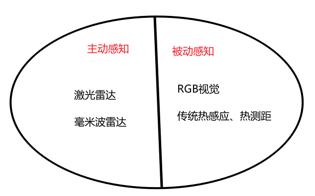
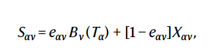
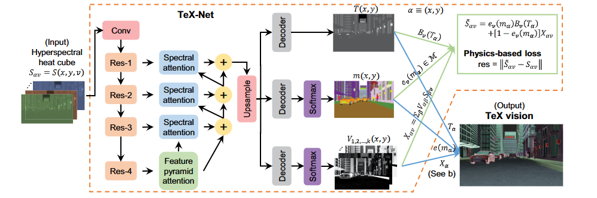
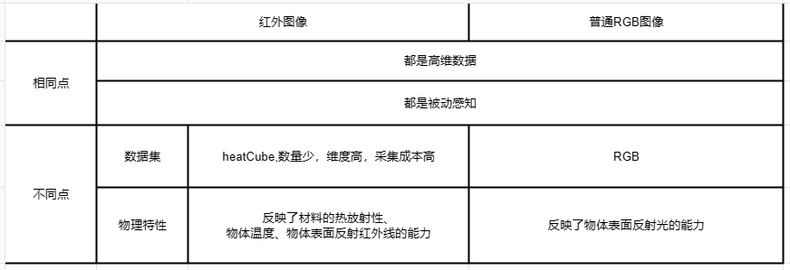

# 论文解决的问题：

提出一套利用红外线解决成像、测距、目标物理特征识别的解决方案：**HADAR(热雷达)**

输入：红外传感器的信号(高维的cube数据)

输出：HSV图片、目标的距离、目标的物理特征

# HADAR的意义

## 1.解决了传统感知技术的诸多问题

### 主动感知的问题：

- 传感器互相干扰。尤其是智能代理(智能汽车等)数量越来越多的当下，这个问题越来越严重。
- 人体健康-感知效果不能兼顾。激光雷达功率过高会伤害眼睛，过低影响感知效果。
- 容易受反射面材质影响。比如过于平整的车表面，有可能无法反射激光，导致激光雷达看不到。

### RGB视觉的问题：

夜晚、雾天、阴天。看不到。

无法区分表面相似的物体。

（PS：智能汽车的幽灵刹车问题，RGB视觉可能会把周围的画识别成物体）

### 传统热感应、热测距的问题：效果差。

当然HADAR就是为了解决这一问题。

# 为什么传统的热感应、热测距效果不好？

## 鬼影

- 红外线成像受多种因素影响，包括温度（T，物理状态），发射率（e，材料特征）和纹理（X，表面几何形状），他们共同被混合到光流之中
- 物体以及环境还会不停发射和反射红外线

鬼影导致画面是糊的，缺乏**纹理**。

# HADAR核心思想：将不同的影响因素分解

## TeX分解

影响物体热成像有三个因素：

- T: Tempreture，温度。
- e: Emissivity,放射率，他表示物体在一定温度下辐射的能量与同一温度下黑体辐射的能量之比。它与物体的材质、表面结构、温度等因素有关。TeX方法中简单地认为它只与材质有关。
- X: Texture，纹理。表面的几何形状。

- 第一项$e_{\alpha v}B_v(T_{\alpha})$表示直接热辐射，$T_{\alpha}$表示物体温度。它不包含纹理。第二项是从物体散射后进入探测器的环境辐射，它携带纹理。

- 下标ν表示波数（频谱）依赖性。
- $B_v$表示黑体辐射，即物体本身所放射出的热辐射(不包括反射的辐射)。它受普朗克定律的支配，是物体所固有的。
- $X_{\alpha v}$=$\sum_{\beta ≠\alpha}V_{\alpha\beta}S_{\beta v}$表示环境中其他物体$\beta$向$\alpha$的环境热辐射。其中$V_{\alpha\beta}$表示热照明系数。

自然界中的高发射率物质（e=1,如动物、植物），第二项接近0，因此极易产生鬼影。

## TeX退化

==从上面的式子中我们可以看到，$S_{av}$在温度 T、发射率 e 和纹理 X 的联合变换下可能不会改变，因此我们不可以从$S_{av}$唯一地确定T、e、X，这被称为**TeX退化**。==

解决方法：把发射率$e_{αν}$分解为$e_ν(m_α)$

需要建立一个材质库$\mathcal{M}$,这样就可以使得$m_\alpha$变成离散信息。

# 网络结构

# 从研究的角度来看：红外感知 VS RGB感知

# 可能的方向：

其实传统CV能做的一般都可以刷一遍。...目标检测、图像分割...

## 多模态。

红外+RGB做夜间低亮度成像

## 红外视频

问题是数据集很匮乏，采集成本很高。
